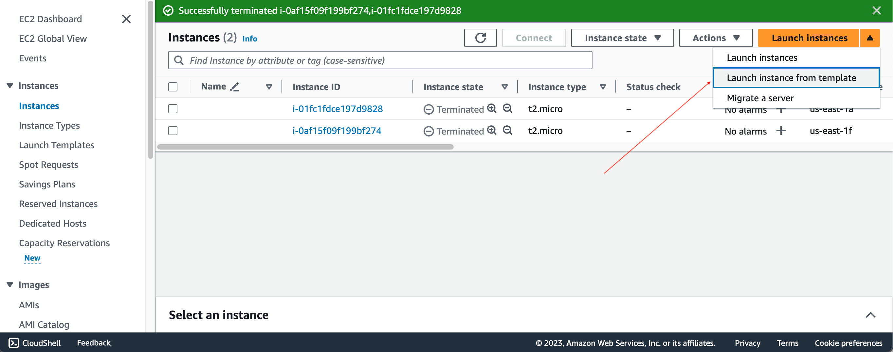

# ReplayTest
Distributed replay of transactions. Distributed to run entire history in a short period of time.

## Description
Spins up many hosts that work together to process the entire history of EOS. Each instance is designated to test a unique range of blocks. At the end of the range the integrity hash is checked against a previous run to ensure validity of the replay.

See [High Level Design](docs/high-level-design.md). The service has two components an orchestrator node, and many replay nodes. The replay nodes connect to the orchestrator via HTTP to fetch job configuration and update status.

For a description of the HTTP calls supported by the orchestrator see [HTTP Service Calls](docs/http-service-calls.md)

## Orchestrator Setup
First you need to setup an orchestrator, then you need to setup your relay nodes. Best way to do this is through the AWS portal. *Not sure of the roles and permissions you need to start these services. Need to fill in that information* If you would like to configure your own launch template see [AWS Host Setup](docs/AWS-Host-Setup.md)

To setup your orchestrator node. Go to EC2 Instances


Select launch instance from template


Select `LowEndOrchestrator` and use the default template.


## Updating Orchestrator Job Configuration
By default the setup will spin up a webservice with [Production Run from Jan 2024](meta-data/full-production-run-20240101.json). To change the job configuration you need to create your own JSON configuration, and restart the service to use the new JSON. **Note** need to use `nohup` on python webservice to keep the process running after ssh-shell exit.
- Create your own JSON following the example formate from `test-simple-jobs.json`
- Upload the file to the orchestrator node
- Log into the orchestrator node as `ubuntu` user
- Kill the existing service named `python3 ... webservice.py`
- Restart with your configuration `nohup python3 $HOME/replay-test/orchestration-service/web_service.py --config my-config.json --host 0.0.0.0 --log ~/orch-complete-timings.log &`

## Replay Setup
You can spin up as many replay nodes as you need. Replay nodes will continuously pick and process new jobs. Each replay host works on one job at a time before picking up the next job. Therefore a small number of replay hosts will process all the jobs given enough time. For example, if there are 100 replay slices configured at most 100 replay hosts, and as few as 1 replay host, may be utilized.

To run the replay nodes ssh into the orchestrator node and run [run-replay-instance.sh](scripts/replayhost/run-replay-instance.sh). The script takes two arguments the first is the number of replay hosts to spin up. The second argument indicates this is a dry run, and don't start up the hosts.
```
ssh -i private.key -l ubuntu orchestor
cd replay-test
scripts/replayhost/run-replay-instance.sh 10 [DRY-RUN]
```

**Note**: It is important to run this script, as it injects the IP address of the orchestrator node into the replay nodes. Without this script you would need to manually update all the replay nodes with the IP address of the orchestrator.

## Web Dashboard
You can see the status of jobs, configuration, and summary of replay status by using the webservice on the orchestrator node. Navigate to `http://orchestor.example.com/`.

Many HTTP calls support HTML, JSON, and Text responses. Look at [HTTP Service Calls](docs/http-service-calls.md) for other URL options and Accept encoding options.

## Termination of Replay Nodes
Replay nodes are not automatically terminated. To save on hosting costs, it is advisable to terminate the nodes after the replay tests are completed. Termination can be accomplished using the AWS dashboard or by running the termination script.

```
ssh -i private.key -l ubuntu orchestor
cd replay-test
scripts/replayhost/terminate-replay-instance.sh ALL [DRY-RUN]
```

## Operating Details
See [Operating Details](docs/operating-details.md) for list of scripts, logs, and data.

## Testing
For testing options see [Running Tests](docs/running-tests.md)

## Generating Manifests
The python script `replay-test/scripts/manifest/generate_manifest.py` will build a manifest off either the snapshots listed in S3 or the list of eos nation snapshots. By default connects to S3 to build snapshot list, and requires `aws cli` and read permissions. A manifest may be validated for valid JSON and a contiguous block range using the [validate_manifest.py](scripts/manifest/validate_manifest.py) script

Redirect of stdout is recommended to separate the debug messages printed on stderr
`python3 generate_manifest.py --source-net mainnet 1> ./manifest-config.json`  

### Options
In this release `block-space-between-slices`, `max-block-height`, and `min-block-height`.

- `--source-net` Defaults to `mainnet`. Which chain to target. Options include mainnet, kylin, and jungle
- `--leap-version` Defaults to `5.0.0`. Specify the version of leap to use from the builds
- `--snapshot-version` Defaults to v6.
- `--source-eosnation` Build manifest from eos-nation webpage of snapshots
- `--upload-snapshots` Flag takes no values, and defaults to false. This uploads snapshots to AWS S3. Must have `aws cli` and permission to upload.
- `--block-space-between-slices` Min number of blocks between slices, cuts down on the number of slices created
- `--max-block-height` Limits manifest by not processing starting block ranges above value
- `--min-block-height` Limits manifest by not processing starting block ranges below value
- `--debug` Prints out internal status messages
